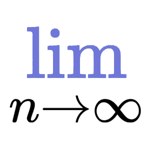
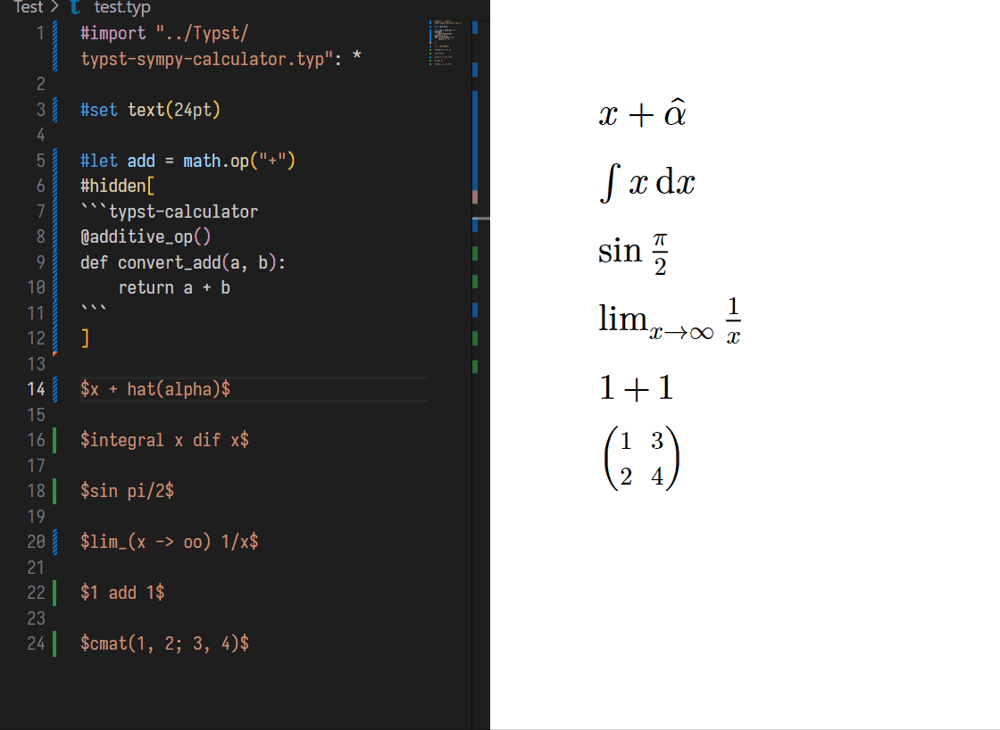

# Typst Sympy Calculator

## About

`Typst Sympy Calculator` parses **typst math expressions** and converts it into the equivalent **SymPy form**. Then, **calculate it** and convert to typst result. 

It is designed for providing **people writing in typst** a ability to calculate something when writing math expression. It is based on `Python`, `Sympy` and [`typst-sympy-calculator`](https://github.com/OrangeX4/typst-sympy-calculator) module.

PS: If you want to install the extension, **PLEASE READ THE INSTALL DESCRIPTION!**


## Features


- **Default Math:**
    - [x] **Arithmetic:** Add (`+`), Sub (`-`), Dot Mul (`dot`), Cross Mul (`times`), Frac (`/`), Power (`^`), Abs (`|x|`), Sqrt (`sqrt`), etc...
    - [x] **Alphabet:** `a - z`, `A - Z`, `alpha - omega`, Subscript (`x_1`), Accent Bar(`hat(x)`), etc...
    - [x] **Common Functions:** `gcd`, `lcm`, `floor`, `ceil`, `max`, `min`, `log`, `ln`, `exp`, `sin`, `cos`, `tan`, `csc`, `sec`, `cot`, `arcsin`, `sinh`, `arsinh`, etc...
    - [x] **Funcion Symbol:** `f(x)`, `f(x-1,)`, `g(x,y)`, etc...
    - [x] **Calculous:** Limit `lim_(x -> oo) 1/x`, Integration `integral_1^2 x dif x`, etc...
    - [ ] **Calculous:** Derivation (`dif/(dif x) (x^2 + 1)`), etc...
    - [ ] **Reduce:** Sum `sum_(k=1)^oo (1/2)^k`, Product `product_(k=1)^oo (1/2)^k`
    - [x] **Linear Algebra:** Matrix to raw echelon form `rref`, Determinant `det`, Transpose `^T`, Inverse `^(-1)`, etc...
    - [x] **Relations:** `==`, `>`, `>=`, `<`, `<=`, etc...
    - [ ] **Solve Equation:** Single Equation `x + 1 = 2`, Multiple Equations `cases(x + y = 1, x - y = 2)`, etc...
    - [x] **Other:** Binomial `binom(n, k)` ...
- **Custom Math (in typst file):**
    - [x] **Define Accents:** `#let acc(x) = math.accent(x, math.grave)`
    - [x] **Define Operators:** `#let add = math.op("add")`
    - [x] **Define Symbols:** `#let xy = math.italic("xy")` or `#let mail = symbol("🖂", ("stamped", "🖃"),)`
    - [x] **Define Functions:**
        ```py
        # typst-calculator
        @func()
        def convert_add(a, b):
            return a + b
        ```
- **Typst Math Printer:**
    - [x] Complete `TypstMathPrinter` in `TypstConverter.py`
    - [ ] Custom Printer for `TypstCalculator.py` and `TypstCalculatorServer.py`
- **VS Code Extension:**
    - [x] Develop a VS Code Extension for `Typst Calculator`


## Install

**IT IS IMPORTANT!** 
**IT IS IMPORTANT!**
**IT IS IMPORTANT!**

Before you use the extension, please install python and two python modules: `typst-sympy-calculator` and `Flask`.

Install **Python** in [Python.org](https://www.python.org/), and then install **NECESSARY modules** by running:

```sh
pip install typst-sympy-calculator
pip install Flask
```

Then import the typst template file [`typst-sympy-calculator.typ`](https://github.com/OrangeX4/typst-sympy-calculator.typ) into your typst file. It will be like:

```typst
import "typst-sympy-calculator.typ": *
```


## Usage



### Typst to Typst

You can **SELECT** some text, and press `Shift + Ctrl + Alt + E` (equal) to get the result of the selected Typst text. It will be like:

```typst
// Before
$ integral x dif x $

// After
$ integral x dif x = 1/2 x^2 $
```

You can **SELECT** some text, and press `Shift + Ctrl + Alt + R` (replace) to get the result of the selected Typst text. It will be like:

```typst
// Before
$ integral x dif x $

// After
$ 1/2 x^2 $
```


### Factor and Expand

You can **SELECT** some text, and press `Shift + Ctrl + Alt + F` (factor) to get the factor of the selected Typst text. It will be like:

```typst
// Before
$ x^2 + 2 x y + y^2 $

// After
$ (x + y)^2 $
```

If you are using **windows**, the shortcut `Shift + Ctrl + Alt + F` may be invalid, you can set another shortcut for it.

You can **SELECT** some text, and press `Shift + Ctrl + Alt + X` (expand) to get the expand of the selected Typst text. It will be like:

```typst
// Before
$ (x + y)^2 $

// After
$ x^2 + 2 x y + y^2 $
```

### Typst to Numerical Result

You can **SELECT** some text, and press `Shift + Ctrl + Alt + N` (numerical) to get the numerical result of the selected Typst text. It will be like:

```typst
// Before
sqrt(2)

// After
1.41421356237310
```

### Variances

You can **ASSIGN** variance a value using same assignment form in typst:

```typst
#let x = 1

// Before
$ x $

// Shift + Ctrl + E
// After
$ x = 1 $
```

PS: You can use grammar like `y == x + 1` to describe the relation of equality.

If you want to see the bonding of variances, you can press `Shift + Ctrl + P`, and input `typst-sympy-calculator: Show Current variances`, then you will get data like:

```typst
y = x + 1
z = 2 x
```

### Functions

You can **DEFINE** a function using same form in typst:

```typst
#let f = math.op("f")

// Before
$ f(1) + f(1) $

// Shift + Ctrl + E
// After
$ f(1) + f(1) = 2 f(1) $
```

### Symbols

You can **DEFINE** a symbol using same form in typst:

```typst
#let xy = math.italic("xy")
#let email = symbol("🖂", ("stamped", "🖃"),)

$ xy + email + email.stamped $
```

### Accents

You can **DEFINE** a accent using same form in typst:

```typst
#let acc(x) = math.accent(x, math.grave)

$ acc(x) $
```

### Decorators for Operators

You can **DEFINE** a operator using same form in typst:

```typst
#let add = math.op("+")

'''typst-calculator
@additive_op()
def convert_add(a, b):
    return a + b
'''

// Before
$ 1 add 1 $

// Shift + Ctrl + E
// After
$ 1 add 1 = 2 $
```

Or just use `'''typst-sympy-calculator` or `'''python \n # typst-calculator` to define a operator.

there are some decorators you can use:

- `@operator(type='ADDITIVE_OP', convert_ast=convert_ast, name=name, ast=False)`: Define a common operator;
- `@func()`: Define a function, receive args list; 
- `@func_mat()`: Define a matrix function, receive single arg `matrix`;
- `@constant()`: Define a constant, receive no args but only return a constant value;
- `@relation_op()`: Define a relation operator, receive args `a` and `b`;
- `@additive_op()`: Define a additive operator, receive args `a` and `b`;
- `@mp_op()`: Define a multiplicative operator, receive args `a` and `b`;
- `@postfix_op()`: Define a postfix operator, receive args `a`;
- `@reduce_op()`: Define a reduce operator, NOT IMPLEMENTED YET;

It is important that the function name MUST be `def convert_{operator_name}`, or you can use decorator arg `@func(name='operator_name')`, and the substring `_dot_` will be replaced by `.`.

There are some examples (from [DefaultTypstCalculator.py](https://github.com/OrangeX4/typst-sympy-calculator/blob/main/DefaultTypstCalculator.py)):

```python
# Constants
@constant()
def convert_oo():
    return sympy.oo

# Relation Operators
@relation_op()
def convert_eq(a, b):
    return sympy.Eq(a, b)

# Additive Operators
@additive_op()
def convert_plus(a, b):
    return a + b

# Mp Operators
@mp_op()
def convert_times(a, b):
    return a * b

# Postfix Operators
@postfix_op()
def convert_degree(expr):
    return expr / 180 * sympy.pi

# Matrix
@func_mat()
def convert_mat(mat):
    return sympy.Matrix(mat)

# Functions
@func()
def convert_binom(n, k):
    return sympy.binomial(n, k)
```


### Python

You can calculate a python expression by `Shift + Ctrl + Alt + P`.

**You can use all sympy expression in it.**

For example, you can get variances you assigned by:

``` python
# Before
typst(var['y'])

# After
typst(var['y']) = x + 1
```

Calculator the roots of the equation:

``` python
# Before
sympy.solve([2 * x - y - 3, 3 * x + y - 7],[x, y])

# After
sympy.solve([2 * x - y - 3, 3 * x + y - 7],[x, y]) = {x: 2, y: 1}
```


## Thanks

- [augustt198 / latex2sympy](https://github.com/augustt198/latex2sympy)
- [purdue-tlt / latex2sympy](https://github.com/purdue-tlt/latex2sympy)
- [ANTLR](https://www.antlr.org/)
- [Sympy](https://www.sympy.org/en/index.html)


## License

This project is licensed under the MIT License.